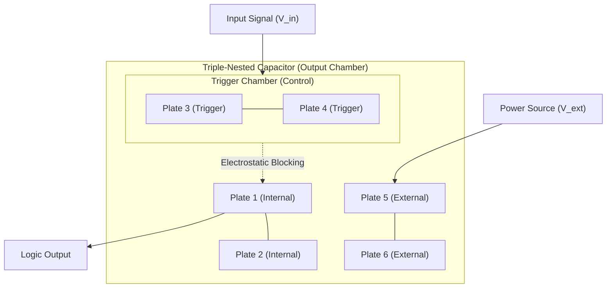

# FTA: The Field Transistor Alternative (Whitepaper)
### Conceptual Architect: Basel Yahya Abdullah (باسل يحيى عبدالله)
### Implementation: Antigravity

## 1. Introduction
The **Field Transistor Alternative (FTA)** is a revolutionary electronic switching and logic architecture based on the principle of **Nested Electrostatic Fields**. Unlike traditional transistors that rely on the drift and diffusion of carriers (electrons and holes) across P-N junctions, the FTA uses the additive blocking effects of potential barriers within nested capacitors to perform logic.

## 2. The Core Principle: Nested Capacitors (NC)
The architecture consists of multi-plate "Nested Capacitors" (TNC). A triple-nested system (6 plates) allows for discrete signal control:

- **Electrostatic Blocking**: Internal field bias ($V_{in}$) modulates the permeability of an external potential, creating a controllable "Barrier Potential" without semi-conductor junctions.
- **Result**: Zero carrier-recombination delay and potentially GHz-level switching speeds with near-zero heat dissipation.

## 3. Verified Computational Modes
Our research has identified three distinct operational modes for the FTA:
1. **Static Logic Mode**: High-resistance dielectric state used for traditional binary gates (NAND, NOR).
2. **RF Mode (Resonant)**: Medium-resistance state (15-20Ω) where the system enters self-oscillation, acting as a high-frequency alternating signal generator.
3. **Neuro Mode (Spiking)**: Low-mobility (Ionic) dielectric state exhibiting slow, biological-like "Integrate-and-Fire" pulses (1-10 Hz).

## 4. Architectural Breakthroughs
We have successfully simulated and verified the following units:
- **Logic**: A functional **NAND Gate**.
- **Arithmetic**: A **4-Bit Parallel Adder** (e.g., $7+5=12$).
- **Memory**: A **1-Bit D-Latch** (Data Persistence).

## 5. Advanced Frontier: Asymmetry & Decimal Logic
Our latest research has pushed the boundaries of the FTA architecture into two new domains:

### A. Asymmetric Field Dynamics
By alternating 'Saturated' (Conductive) and 'Depleted' (Isolating) gaps in a multi-plate stack, we have discovered the **Field Diode Effect**. This allows for the programmable concentration of electrostatic fields in specific "Trigger Zones," enabling unidirectional signal control and "Field Trapping" for multi-level logic.

### B. Decimal & Multi-Valued Logic (MVL)
We have implemented a **10-State Potential Staircase** using an 11-plate stack. This allows a single FTA unit to represent digits **0-9**.
- **Information Density**: 3.32x increase over traditional binary systems.
- **Impact**: Enables base-10 computation, mimicking human arithmetic and drastically reducing hardware complexity for complex math.

## 6. Conclusion & Future Outlook
The FTA architecture is **Turing-Complete** and conceptually ready for physical miniaturization. By eliminating the bottlenecks of traditional silicon-based CMOS and introducing Multi-Valued Logic, the FTA offers a path toward sub-nanosecond, ultra-dense, and ultra-low-power computing.

---
© 2026 Basel Yahya Abdullah. All Rights Reserved.
