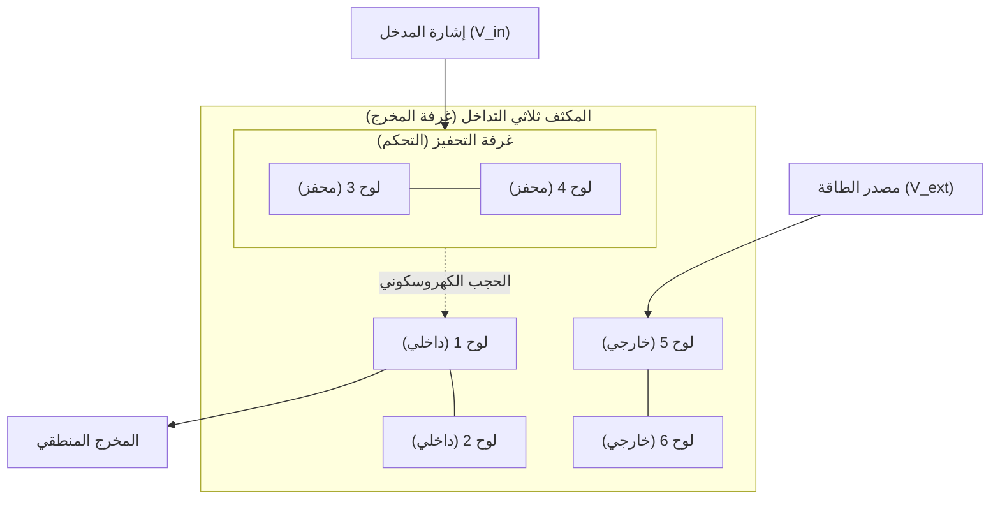

# FTA: بديل الترانزستور الميداني (الورقة البيضاء)
### المعماري المفاهيمي: باسل يحيى عبدالله
### التنفيذ: Antigravity

## 1. مقدمة
**بديل الترانزستور الميداني (FTA)** هو هندسة ثورية للتبديل الإلكتروني والمنطق تعتمد على مبدأ **المجالات الكهروسكونية المتداخلة**. على عكس الترانزستورات التقليدية التي تعتمد على انجراف وانتشار الحوامل (الإلكترونات والفجوات) عبر وصلات P-N، يستخدم FTA تأثيرات الحجب المضافة لحواجز الجهد داخل المكثفات المتداخلة لأداء المنطق.

## 2. المبدأ الجوهري: المكثفات المتداخلة (NC)
تتكون الهندسة من "المكثفات المتداخلة" (TNC) متعددة الألواح. يسمح النظام الثلاثي المتداخل (6 ألواح) بالتحكم في الإشارات المنفصلة:

- **الحجب الكهروسكوني**: انحياز المجال الداخلي ($V_{in}$) يعدل نفاذية الجهد الخارجي، مما يخلق "جهد حاجز" يمكن التحكم فيه بدون وصلات أشباه الموصلات.
- **النتيجة**: لا يوجد تأخير في إعادة اتحاد الحوامل وسرعات تبديل قد تصل إلى مستوى الجيجاهرتز مع تبديد حرارة شبه منعدم.

## 3. أوضاع الحوسبة المحققة
حدد بحثنا ثلاثة أوضاع تشغيل متميزة لـ FTA:
1. **وضع المنطق الساكن**: حالة عازلة عالية المقاومة تستخدم للبوابات الثنائية التقليدية (NAND, NOR).
2. **وضع التردد الراديوي (الرنيني)**: حالة مقاومة متوسطة (15-20 أوم) حيث يدخل النظام في اهتزاز ذاتي، ليعمل كمولد إشارة متناوبة عالية التردد.
3. **وضع الأعصاب (النبضي)**: حالة عازلة منخفضة الحركة (أيونية) تظهر نبضات بطيئة تشبه النبضات البيولوجية (1-10 هرتز).

## 4. الاختراقات المعمارية
لقد قمنا بمحاكاة والتحقق من الوحدات التالية بنجاح:
- **المنطق**: بوابة **NAND** وظيفية.
- **الحساب**: **جامع متوازي بـ 4 بت** (مثلاً $7+5=12$).
- **الذاكرة**: **D-Latch بـ 1 بت** (استمرارية البيانات).

## 5. آفاق متقدمة: عدم التماثل والمنطق العشري
دفع بحثنا الأخير حدود هندسة FTA إلى مجالين جديدين:

### أ. ديناميكيات المجال غير المتماثلة
من خلال تبديل الفجوات "المشبعة" (الموصلة) و"المستنفدة" (العازلة) في مجموعة ألواح متعددة، اكتشفنا **تأثير صمام المجال الثنائي (Field Diode Effect)**. يسمح هذا بتركيز مبرمج للمجالات الكهروسكونية في "مناطق تحفيز" محددة، مما يتيح التحكم في الإشارة في اتجاه واحد و "حبس المجال" للمنطق متعدد المستويات.

### ب. المنطق العشري ومتعدد القيم (MVL)
لقد قمنا بتنفيذ **سلم جهد بـ 10 حالات** باستخدام مجموعة من 11 لوحاً. يسمح هذا لوحدة FTA واحدة بتمثيل الأرقام **0-9**.
- **كثافة المعلومات**: زيادة قدرها 3.32 مرة عن الأنظمة الثنائية التقليدية.
- **التأثير**: يتيح الحساب الأساسي 10، مما يحاكي الحساب البشري ويقلل بشكل كبير من تعقيد الأجهزة للعمليات الرياضية المعقدة.

## 6. الخاتمة والنظرة المستقبلية
هندسة FTA هي **كاملة تورينج (Turing-Complete)** وجاهزة من الناحية المفاهيمية للتصغير المادي. من خلال القضاء على اختناقات CMOS التقليدية القائمة على السيليكون وتقديم المنطق متعدد القيم، يوفر FTA مساراً نحو حوسبة فائقة الكثافة ومنخفضة الطاقة للغاية وبسرعة أقل من النانو ثانية.

---
© 2026 باسل يحيى عبدالله. جميع الحقوق محفوظة.
