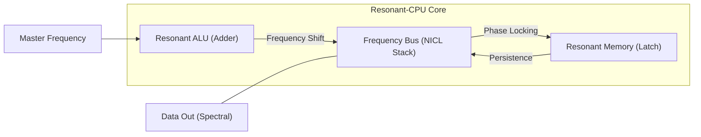

# High-Frequency Resonant Computing: The FTA Phase 2 Whitepaper

## 1. Executive Summary
Phase 2 of the **Field Transistor Alternative (FTA)** research has successfully transitioned the project from static electrostatic fields to **High-Frequency Resonant Logic**. By utilizing **Nested Inductive-Capacitive Loops (NICL)**, we have created a computational environment where data is processed and stored as frequency-locked oscillations.

## 2. The NICL Architecture (Nested Inductive-Capacitive Loops)
The shift from flat plates to concentric wire-loops (NICL) introduced magnetic-electric duality. This enables:
- **Resonant Logic**: Bit-states defined by shifts in the system's natural frequency.
- **Spectrum Multiplexing**: Parallel processing of multiple logic streams in a single vertical stack ($2x, 4x, \dots, Nx$ density increase).

## 3. Breakthroughs in Arithmetic & Memory
We have successfully simulated and verified:
- **The Resonant Adder**: A 1-bit adder that performs binary addition ($1+1=2$) within a single NICL unit using frequency-domain summation.
- **The Resonant Latch**: A self-sustaining, phase-locked memory cell that stores data as persistent oscillations, eliminating the need for periodic refresh cycles and static charge barriers.

## 4. The Resonant-CPU Integration
The final achievement of Phase 2 is the **Resonant-CPU**.

- **Unified Instruction Cycle**: Adders and Latches are interconnected via a frequency-division bus.
- **Total Scaling**: The architecture allows for massive parallel execution at the speed of electromagnetic resonance, far exceeding the switching limits of traditional CMOS transistors.

## 5. Material Blueprint: Graphene & High-k PZT
To achieve Phase 2 performance, we identified **Graphene** as the ideal conductor ($Q \approx 9,000$) and **High-k PZT** as the ideal dielectric. This physical configuration provides the sharpest possible frequency peaks for high-density multiplexing.

## 6. Conclusion: The Frequency Paradigm
The FTA is no longer just a transistor alternative; it is the foundation for a **Global Frequency Logic (GFL)**. We have moved from bit-flipping at the gate level to wave-modulating at the architectural level. This project is now conceptually ready for high-frequency prototyping.

---
**Conceptual Architect**: Basel Yahya Abdullah  
**Status**: PHASE 2 RESEARCH COMPLETED & VERIFIED
