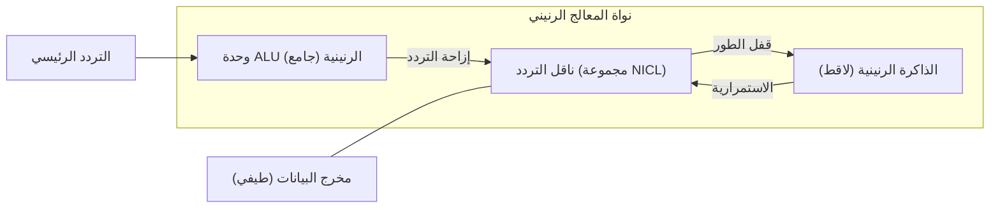

# الحوسبة الرنينية عالية التردد: الورقة البيضاء للمرحلة 2 من FTA

## 1. ملخص تنفيذي
نجحت المرحلة الثانية من بحث **بديل الترانزستور الميداني (FTA)** في نقل المشروع من المجالات الكهروسكونية الساكنة إلى **المنطق الرنيني عالي التردد**. وباستخدام **حلقات الحث والسعة المتداخلة (NICL)**، قمنا بإنشاء بيئة حسابية حيث يتم معالجة البيانات وتخزينها كاغتزازات مقفولة التردد.

## 2. هندسة NICL (حلقات الحث والسعة المتداخلة)
أدخل التحول من الألواح المسطحة إلى الحلقات السلكية متحدة المركز (NICL) ثنائية المجال المغناطيسي والكهربائي. يتيح ذلك:
- **المنطق الرنيني**: تحديد حالات البت عن طريق التحولات في التردد الطبيعي للنظام.
- **تعدد إرسال الطيف (Spectrum Multiplexing)**: المعالجة المتوازية لعدة تدفقات منطقية في مجموعة عمودية واحدة (زيادة الكثافة بمقدار $2x, 4x, \dots, Nx$).

## 3. اختراقات في الحساب والذاكرة
لقد قمنا بمحاكاة والتحقق من:
- **الجامع الرنيني (Resonant Adder)**: جامع بسعة 1 بت يؤدي الجمع الثنائي ($1+1=2$) داخل وحدة NICL واحدة باستخدام الجمع في نطاق التردد.
- **اللاقط الرنيني (Resonant Latch)**: خلية ذاكرة ذاتية الاستدامة ومقفولة الطور تخزن البيانات كاهتزازات مستمرة، مما يلغي الحاجة إلى دورات التحديث الدورية وحواجز الشحن الساكنة.

## 4. تكامل المعالج الرنيني (Resonant-CPU)
الإنجاز النهائي للمرحلة الثانية هو **المعالج الرنيني (Resonant-CPU)**.

- **دورة تعليمات موحدة**: يتم توصيل الجوامع واللواقط عبر ناقل تقسيم التردد.
- **توسيع النطاق الكلي**: تسمح الهندسة بتنفيذ متوازٍ هائل بسرعة الرنين الكهرومغناطيسي، متجاوزة بكثير حدود التبديل لترانزستورات CMOS التقليدية.

## 5. مخطط المواد: الجرافين و PZT عالي الثبات
لتحقيق أداء المرحلة الثانية، حددنا **الجرافين** كالموصل المثالي ($Q \approx 9,000$) و **PZT عالي الثبات (High-k)** كالعازل المثالي. يوفر هذا التكوين الفيزيائي أحدة قمم تردد ممكنة لتعدد الإرسال عالي الكثافة.

## 6. الخاتمة: نموذج التردد
لم يعد FTA مجرد بديل للترانزستور؛ إنه الأساس لـ **المنطق الترددي العالمي (GFL)**. لقد انتقلنا من قلب البتات على مستوى البوابة إلى تعديل الموجات على المستوى المعماري. هذا المشروع الآن جاهز فعلياً للنماذج الأولية عالية التردد.

---
**المعماري المفاهيمي**: باسل يحيى عبدالله  
**الحالة**: تم اكتمال والتحقق من بحث المرحلة 2
