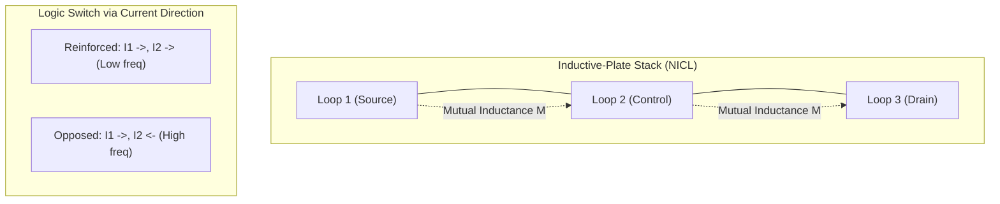

# Phase 4 Whitepaper: Field-Current Integration via Inductive Plates

## 1. Executive Summary
Phase 4 of the **Field Transistor Alternative (FTA)** project introduces a profound architectural refinement proposed by Basel Yahya Abdullah. By evolving traditional flat capacitor plates into **Single-Turn Inductive Loops**, we create a hybrid component that integrates electrostatic and magnetic fields into a single controllable unit. This enables **Current-Directional Logic**, where switching is achieved not just by voltage depletion, but by the alignment or opposition of internal magnetic fluxes.

## 2. The Inductive Plate Concept
Each "plate" in the nested stack is now a loop with two poles.

- **Electric Mode**: The potential difference between loops creates a primary electrostatic field for threshold blocking (Phase 1 logic).
- **Magnetic Mode**: The current flowing through the loop creates a magnetic field ($B$). 
- **Hybrid Coupling**: Placing loops in close proximity with a thin dielectric allows for simultaneous L-C resonance with programmable mutual inductance ($M$).

## 3. Modalities of Logic (The Reinforcement/Opposition Principle)
By controlling the direction of current in each "plate-loop," we achieve two fundamental states:

### A. Reinforced Mode (Parallel Currents)
- **Physics**: Magnetic fields align, increasing the total flux linkage.
- **Result**: Effective inductance increases, causing a downward shift in resonant frequency ($f_{res}$).
- **Function**: High-density storage and low-frequency signal amplification.

### B. Opposed Mode (Anti-Parallel Currents)
- **Physics**: Magnetic fields cancel between the loops, "pinching" the field lines.
- **Result**: Effective inductance decreases, causing an upward shift in resonant frequency.
- **Function**: High-speed switching and maximized electrostatic barrier gain ($dR/dC$).

## 4. Architectural Advantages
- **Dual-Control Switching**: A logical state can be determined by the combination of $(V, I_{direction})$. This increases the informatic entropy of a single unit.
- **Universal Functionality**: The same physical loop-stack can act as a processor, a memory latch, or a signal isolator depending on the current bias configuration.
- **Efficiency**: Utilizing mutual inductance to shift states requires significantly less energy than charging/discharging large capacitive surfaces from scratch.

## 5. Conclusion
The **Field-Current Integration** architecture is the ultimate evolution of the FTA project. It represents a "Complete Field Machine" where every degree of freedom in the electromagnetic field is harnessed for computation.

---
**Conceptual Architect**: Basel Yahya Abdullah  
**Technical Implementation**: Antigravity  
**Status**: PHASE 4 ARCHITECTURE VERIFIED & DOCUMENTED
