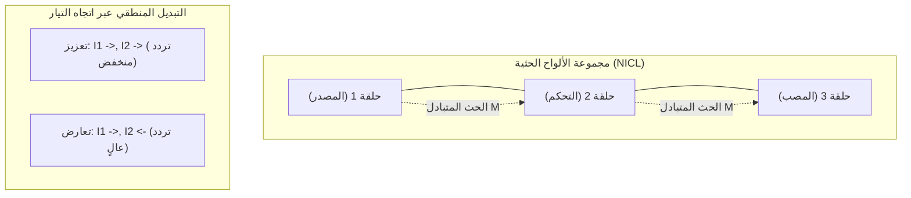

# الورقة البيضاء للمرحلة 4: تكامل المجال والتيار عبر الألواح الحثية

## 1. ملخص تنفيذي
تقدم المرحلة الرابعة من مشروع **بديل الترانزستور الميداني (FTA)** تحسيناً معماريًّا عميقاً اقترحه باسل يحيى عبدالله. من خلال تطوير ألواح المكثفات المسطحة التقليدية إلى **حلقات حثية أحادية اللفة**، نقوم بإنشاء مكون هجين يدمج المجالات الكهروسكونية والمغناطيسية في وحدة واحدة قابلة للتحكم. يتيح ذلك **منطق اتجاه التيار (Current-Directional Logic)**، حيث يتم التبديل ليس فقط من خلال نضوب الجهد، ولكن من خلال محاذاة أو تعارض التدفقات المغناطيسية الداخلية.

## 2. مفهوم اللوح الحثي
كل "صفيحة" في المجموعة المتداخلة هي الآن حلقة ذات قطبين.

- **الوضع الكهربائي**: فرق الجهد بين الحلقات يخلق مجالاً كهروسكونياً أساسياً لحجب العتبة (منطق المرحلة 1).
- **الوضع المغناطيسي**: التيار المتدفق عبر الحلقة يخلق مجالاً مغناطيسياً ($B$).
- **الاقتران الهجين**: وضع الحلقات على مقربة شديدة مع عازل رقيق يسمح برنين L-C متزامن مع حث متبادل ($M$) قابل للبرمجة.

## 3. أنماط المنطق (مبدأ التعزيز والتعارض)
من خلال التحكم في اتجاه التيار في كل "لوح حلقي"، نحقق حالتين أساسيتين:

### أ. وضع التعزيز (تيارات متوازية)
- **الفيزياء**: تتحاذى المجالات المغناطيسية، مما يزيد من إجمالي ارتباط التدفق.
- **النتيجة**: يزداد الحث الفعال، مما يسبب إزاحة هبوطية في تردد الرنين ($f_{res}$).
- **الوظيفة**: تخزين عالي الكثافة وتضخيم الإشارات منخفضة التردد.

### ب. وضع التعارض (تيارات متوازية متضادة)
- **الفيزياء**: تتعارض المجالات المغناطيسية بين الحلقات، مما يؤدي إلى "قرص" لخطوط المجال.
- **النتيجة**: ينخفض الحث الفعال، مما يسبب إزاحة تصاعدية في تردد الرنين.
- **الوظيفة**: تبديل عالي السرعة وتعظيم كسب حاجز الجهد الكهروسكوني ($dR/dC$).

## 4. المزايا المعمارية
- **تبديل مزدوج التحكم**: يمكن تحديد الحالة المنطقية من خلال الجمع بين $(V, I_{direction})$. وهذا يزيد من العشوائية المعلوماتية (informatic entropy) للوحدة الواحدة.
- **العالمية الوظيفية**: يمكن لنفس المجموعة الفيزيائية أن تعمل كمعالج، أو لاقط ذاكرة، أو عازل إشارة بناءً على تكوين انحياز التيار.
- **الكفاءة**: يتطلب استخدام الحث المتبادل لإزاحة الحالات طاقة أقل بكثير من شحن وتفريغ السطوح السعوية الكبيرة من الصفر.

## 5. الخاتمة
معمارية **تكامل المجال والتيار** هي التطور النهائي لمشروع FTA. إنها تمثل "آلة مجال كاملة" حيث يتم تسخير كل درجة حرية في المجال الكهرومغناطيسي للحوسبة.

---
**المعماري المفاهيمي**: باسل يحيى عبدالله  
**التنفيذ التقني**: Antigravity  
**الحالة**: تم التحقق من معمارية المرحلة 4 وتوثيقها
