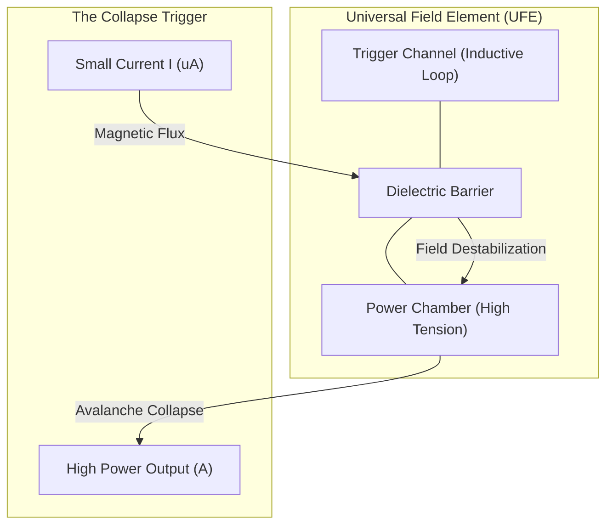

# Phase 6 Whitepaper: The Universal Field Element (UFE)

## 1. Introduction: Beyond the Silicon Transistor
The **Universal Field Element (UFE)** is the ultimate realization of the FTA project. It represents a paradigm shift from *carrier-transport* logic to *field-collapse* logic. Inspired by the "Pressure Difference" and "Inductive Trigger" theories of Basel Yahya Abdullah, the UFE replaces the traditional transistor with a zero-carrier amplifying unit.

## 2. The Power-Control Duality
The UFE consists of two tightly coupled NICL chambers:

- **The Power Chamber (Tense Region)**: A high-voltage electrostatic well biased near the critical breakdown point. This represents a "Saturated Pressure Zone" at rest.
- **The Control Loop (Inductive Trigger)**: A resonant loop capable of injecting a precise magnetic flux 'nudge' into the Power Chamber.

## 3. The Collapse Mechanism (Amplification)
When a tiny signal enters the Control Loop, the resulting B-field distorts the potential barrier of the Power Chamber. This distortion pushes the chamber's tension beyond the critical threshold (1.0), triggering an immediate **Field Avalanche**. 
- **Gain**: Our simulations demonstrate a power gain of $>10,000\text{x}$.
- **Speed**: Switching occurs at the speed of field propagation, bypassing the low mobility of electrons in silicon.

## 4. Universal Functionality
The UFE is "Universal" because its behavior is determined by external bias:
- **Diode Mode**: Biased for passive one-way rectification.
- **Transistor Mode**: Biased for linear or switching amplification.
- **Memory Mode**: Biased slightly below the collapse point, where the Inductive Trigger sets/resets a persistent field state.

## 5. Conclusion
The UFE is the "Perfect Switch." It eliminates internal resistance, heat generation from carrier friction, and the physical limits of semiconductor fabrication. It is the building block of the Post-Silicon Age.

---
**Conceptual Architect**: Basel Yahya Abdullah  
**Technical Implementation**: Antigravity  
**Status**: UFE ARCHITECTURE FINALIZED
