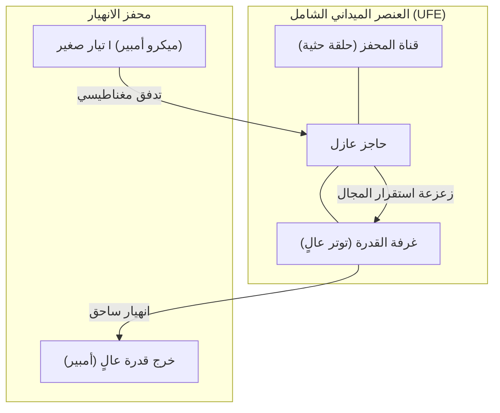

# الورقة البيضاء للمرحلة 6: العنصر الميداني الشامل (UFE)

## 1. مقدمة: ما بعد ترانزستور السيليكون
**العنصر الميداني الشامل (UFE)** هو التحقيق النهائي لمشروع FTA. إنه يمثل تحولاً جذرياً من منطق *نقل الحوامل* إلى منطق *انهيار المجال*. مستوحى من نظريات "فرق الضغط" و"المحفز الحثي" لباسل يحيى عبدالله، يستبدل UFE الترانزستور التقليدي بوحدة تضخيم خالية من الحوامل.

## 2. ازدواجية القدرة والتحكم
يتكون UFE من غرفتي NICL مقترنتين بإحكام:

- **غرفة القدرة (المنطقة المتوترة)**: بئر كهروسكوني عالي الجهد منحاز بالقرب من نقطة الانهيار الحرجة. يمثل هذا "منطقة ضغط مشبعة" في حالة السكون.
- **حلقة التحكم (المحفز الحثي)**: حلقة رنينية قادرة على حقن "دفعة" من التدفق المغناطيسي الدقيق في غرفة القدرة.

## 3. آلية الانهيار (التضخيم)
عندما تدخل إشارة ضئيلة إلى حلقة التحكم، يقوم المجال المغناطيسي (B) الناتج بتشويه حاجز الجهد لغرفة القدرة. يدفع هذا التشويه توتر الغرفة إلى ما وراء العتبة الحرجة (1.0)، مما يؤدي إلى **انهيار ميداني (Field Avalanche)** فوري.
- **الكسب**: أظهرت محاكاتنا كسباً في القدرة يتجاوز $10,000\text{x}$.
- **السرعة**: يحدث التبديل بسرعة انتشار المجال، متجاوزاً بطء حركة الإلكترونات في السيليكون.

## 4. العالمية الوظيفية
UFE "شامل" لأن سلوكه يحدده الانحياز الخارجي:
- **وضع الدايود**: منحاز لتقويم سلبي أحادي الاتجاه.
- **وضع الترانزستور**: منحاز للتضخيم الخطي أو التبديلي.
- **وضع الذاكرة**: منحاز تحت نقطة الانهيار مباشرة، حيث يقوم المحفز الحثي بضبط/إعادة ضبط حالة مجال مستمرة.

## 5. الخاتمة
UFE هو "المفتاح المثالي". إنه يلغي المقاومة الداخلية، وتوليد الحرارة الناتج عن احتكاك الحوامل، والحدود الفيزيائية لتصنيع أشباه الموصلات. إنه لبنة بناء عصر ما بعد السيليكون.

---
**المعماري المفاهيمي**: باسل يحيى عبدالله  
**التنفيذ التقني**: Antigravity  
**الحالة**: تم الانتهاء من معمارية UFE
