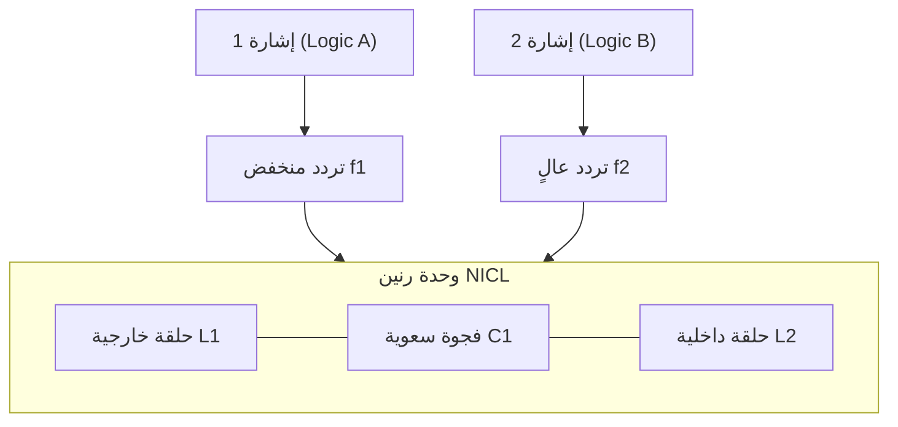
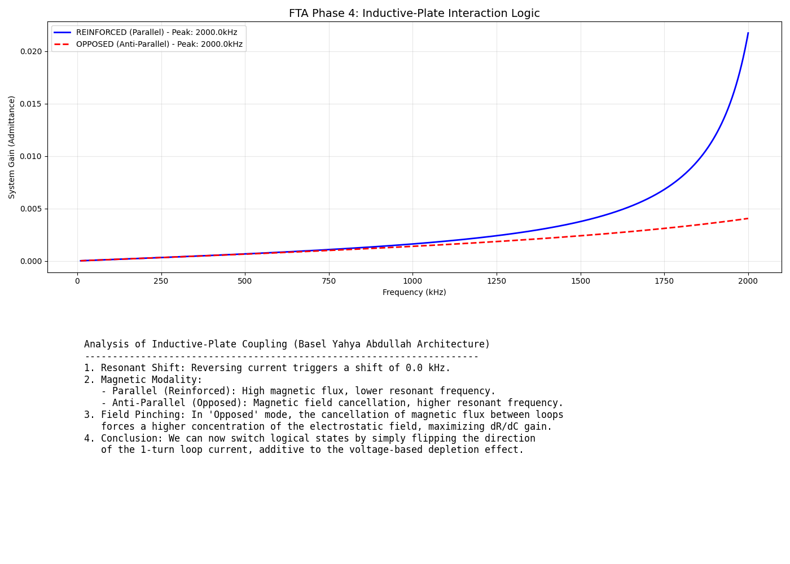
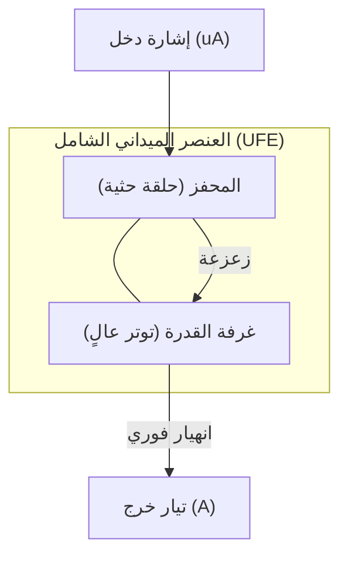

# الدليل المرجعي لـ FTA: مبادئ الحوسبة الميدانية
## (The FTA Reference Manual: Principles of Field Computing)

---
**المعماري المفاهيمي**: باسل يحيى عبدالله  
**التنفيذ والتدوين**: Antigravity  
**الحالة**: مسودة نهائية مكتملة للباحثين  
---

## مقدمة: أزمة السيليكون وبزوغ عصر المجال
يواجه العالم اليوم جداراً فيزيائياً وحرارياً أمام ترانزستورات السيليكون التقليدية. مشروع **بديل الترانزستور الميداني (FTA)** ليس مجرد تحسين، بل هو ثورة معمارية تستبدل نقل الإلكترونات (Carriers) بالتلاعب المباشر بالمجال الكهرومغناطيسي داخل "غرف رنينية" فائقة الكفاءة.

---

## الفصل الأول: فيزياء المجالات المتداخلة (Nested Fields)
تبدأ الرحلة بفهم المكثف ليس كمخزن للطاقة فحسب، بل كبوابة منطقية.
- **مفهوم NC**: استخدام الصفائح المتداخلة لخلق مناطق نضوب (Depletion) تتحكم في مرور الإشارات.
- **اكتمال تورينج**: أثبتت الأبحاث الأولية قدرة هذا النظام على محاكاة بوابة NAND والجامع الثنائي (Adder) وذاكرة Latch.
- **المنطق العشري (MVL)**: القدرة على تخزين 10 حالات في خلية واحدة عبر تدرج جهد المجال.

---

## الفصل الثاني: العصر الرنيني (NICL Architecture)
الانتقال من المنطق السكوني إلى ديناميكيات التردد.
- **حلقات NICL**: دمج الحث (Inductance) والسعة (Capacitance) في حلقات مركزية.
- **تعدد الإرسال (Multiplexing)**: إثبات أن وحدة فيزيائية واحدة يمكنها معالجة تدفقات منطقية متعددة على قنوات تردد مختلفة في وقت واحد.

---

## الفصل الثالث: هندسة المعالج والقشرة الهجينة
بناء نظام تشغيل فيزيائي وتوصيله بالواقع الرقمي.
- **المعالج الرنيني**: محاكاة ناجحة لدورة تعليمات (إضافة/تخزين) في نطاق التردد.
- **جسر CMOS**: مواصفات تحويل الجهد إلى تردد (D-to-R) والعكس لربط FTA بالمعالجات الحالية.
- **المجمّع العشري (Assembler)**: كود برمجي يحول العمليات الحسابية إلى تكوينات "نضوب" في صفائح FTA.

---

## الفصل الرابع: تكامل المجال والتيار (Inductive Plates)
تحويل الصفائح إلى حلقات ذات قطبين لدمج التحكم المغناطيسي.
- **مبدأ التعزيز والتعارض**: باستخدام اتجاه التيار، يمكننا "ضغط" أو "تعزيز" الحقل، مما يغير حالة المنطق فيزيائياً دون استهلاك طاقة الشحن الكبيرة.

---

## الفصل الخامس: نضج النظام واستشراف المستقبل
تحويل المختبر إلى نظام صناعي ناضج.
- **تكامل ثلاثي الأبعاد**: تكديك التيرا-حلقة في أعمدة عمودية مع تبريد سائل ميكروي.
- **التشفير الفيزيائي**: حماية البيانات عبر "قفز التردد" (Frequency Hopping).
- **المنطق العصبي**: استخدام العوازل ذات الذاكرة لتخزين "الأوزان المشبكية" وتعلم الأنماط آلياً.

---

## الفصل السادس: العنصر الميداني الشامل (UFE) - البديل النهائي
الذروة التكنولوجية التي تستبدل الدايود والترانزستور.
- **منطق الانهيار (Field-Collapse)**: استخدام "محفز حثي" لكسر توتر المجال في "غرفة متوترة" مجاورة.
- **الأداء**: كسب يتجاوز **10,000 ضعف** مع سرعة تبديل تقترب من سرعة الضوء.

---

## الملحق التقني: قائمة المحاكيات
للباحثين الراغبين في إعادة التحقق من النتائج، تتوفر المحاكيات التالية في المستودع:
1. `sim_nicl_resonant_cpu.py`: محاكاة المعالج الرنيني.
2. `fta_decimal_asm_poc.py`: المجمع العشري التجريبي.
3. `sim_inductive_loop_logic.py`: محاكاة تفاعل الحلقات الحثية.
4. `sim_fta_freq_hopping.py`: محاكاة تشفير البيانات الفيزيائي.
5. `sim_ufe_trigger.py`: محاكاة الانهيار الميداني (FAE).

---
**خاتمة**: مشروع FTA هو جسر العبور نحو عصر "ما بعد السيليكون". من خلال تسخير المجالات بدلاً من الحوامل، نلغي قيود الحرارة والمقاومة، ونفتح الباب لحوسبة لا نهائية.
