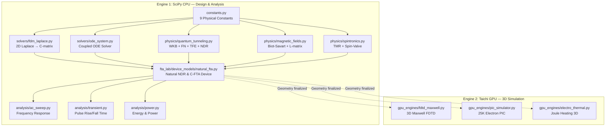

# OOS-Lab v1.0: User Manual
## Open-Source Physics Simulation Laboratory
**Author: Basel Yahya Abdullah | March 2026**

---

**🏆 [دليل الباحث: الخطوات الأولى من التصميم إلى التشغيل](file:///c:/Users/allmy/Desktop/oos/oos_lab/RESEARCHER_GUIDE.md)**

---

## 1. Architecture Overview

OOS-Lab is a **dual-engine** physics simulation toolkit designed for nano-scale electronic device research. Each engine serves a distinct phase of the design workflow.



---

## 2. Design Workflow — When to Use Each Module

### Phase 1: Device Geometry Design

| Module | What It Does | When to Use |
|--------|-------------|-------------|
| `solvers/fdm_laplace.py` | Solves Laplace equation on 2D grid, extracts **capacitance matrix (C)** | **First step** — defines plate positions, spacing, count |
| `physics/magnetic_fields.py` | Computes **inductance matrix (L)** from plate geometry | After C-matrix — adds magnetic coupling |

```python
from oos_lab.solvers.fdm_laplace import solve_capacitance_matrix

# Define your plate positions (x-cells on 120-wide grid)
C, D = solve_capacitance_matrix(
    nx=120, ny=100,
    plate_x_cells=[10, 15, 20, 50, 80, 95],  # 6 plates, asymmetric!
    eps_r=4.0,       # SiO2 dielectric
    dx=1e-9          # 1 nm resolution
)
print(f"Capacitance matrix:\n{C}")
```

---

### Phase 2: Physics Engine Selection

| Module | Physics | Key Function | Use When |
|--------|---------|-------------|----------|
| `physics/quantum_tunneling.py` | | | |
| → `wkb_tunneling_current()` | WKB + Landau + Spin-Orbit | `J = f(E, B, gap, Phi, m_eff, Gamma)` | U-Plate with magnetic gate |
| → `fowler_nordheim_current()` | Standard FN (no B-field) | `J = f(E, Phi)` | Pure electrostatic devices |
| → `fowler_nordheim_tfe()` | FN + Murphy-Good thermal | `J = f(E, T, Phi)` | Temperature-sensitive analysis |
| → `solve_capacitive_circuit()` | Capacitive voltage divider | `V = f(C, nodes, voltages)` | DC operating point |
| → `buriti_ndr_correction()` | Natural NDR Linearity | `J_cor = f(E)` | Buriti/Polystyrene blends |
| → `inverse_material_correction()` | Inverse Gate Physics | `J_inv = f(E)` | PANI/rGO C-FTA Logic |
| `physics/magnetic_fields.py` | | | |
| → `plate_biot_savart()` | B from finite U-plate | `B = f(I, w, L, mu_r, B_sat)` | When plates carry current |
| → `build_inductance_matrix()` | 6×6 mutual inductance | `L = f(plates, distances)` | Multi-plate ODE system |
| → `gap_field()` | Spin-Valve gap calculation | `B = f(B_i, B_j, I_i, I_j)` | Parallel vs anti-parallel effect |
| `physics/spintronics.py` | | | |
| → `tmr_modulation()` | TMR suppression factor | `factor = f(B, Gamma)` | Spin-orbit coupling analysis |
| → `spin_valve_state()` | ON/OFF state detection | `state = f(I_src, I_gate)` | Digital logic design |

```python
from oos_lab.physics.quantum_tunneling import wkb_tunneling_current, fowler_nordheim_tfe
from oos_lab.physics.magnetic_fields import plate_biot_savart, gap_field

# Test ON/OFF ratio
E = 1e9  # V/m
B_on = gap_field(
    plate_biot_savart(+2e-3, 10e-6, 100e-6, mu_r=50000),
    plate_biot_savart(+2e-3, 10e-6, 100e-6, mu_r=50000),
    +2e-3, +2e-3  # Parallel → B cancels
)
B_off = gap_field(
    plate_biot_savart(+2e-3, 10e-6, 100e-6, mu_r=50000),
    plate_biot_savart(-2e-3, 10e-6, 100e-6, mu_r=50000),
    +2e-3, -2e-3  # Anti-parallel → B adds
)
J_on = wkb_tunneling_current(E, B_on)
J_off = wkb_tunneling_current(E, B_off)
print(f"ON/OFF ratio: {J_on/J_off:.1f}x")
```

---

### Phase 3: Full Device Simulation

| Module | What It Does | Output |
|--------|-------------|--------|
| `fta_lab/device_models/natural_fta.py` | **Natural NDR Device** — integrates Buriti/VO2/PANI models into nested-inductor FTA | Linearized & Complementary Logic |
| `devices/u_plate.py` | **Classic U-Plate** — integrates C-matrix, L-matrix, WKB, Biot-Savart, TMR into a 12D ODE | Spintronic analysis |

```python
from oos_lab.devices.u_plate import UPlateDevice, UPlateParams

device = UPlateDevice(UPlateParams(
    n_plates=6,
    plate_x_cells=[10, 15, 20, 50, 80, 95],  # Asymmetric!
    eps_r=4.0,
    Phi_B_eV=1.0,
    mu_r=50000,          # Mu-metal core
    Gamma_spin=3e8,      # Spintronic TMR
    V_DD=12.0,           # Supply voltage
    I_gate=2e-3,         # Gate current
    R_plate=500.0,       # Plate resistance
    R_load=1000.0,       # Output load
    gate_index=1,        # Which plate is the gate
))

# Run with sine wave gate signal
result = device.simulate(
    gate_fn=lambda t: 0.5 * np.sin(2 * np.pi * 1e9 * t),
    t_span=(0, 5e-9),
    n_points=1000
)
```

---

### Phase 4: Performance Analysis

| Module | Analysis Type | Key Output | Use When |
|--------|-------------|-----------|----------|
| `analysis/ac_sweep.py` | Frequency response | Gain vs frequency (Bode) | Bandwidth characterization |
| `analysis/transient.py` | Pulse response | Rise time, fall time (ps) | Digital switching speed |
| `analysis/power.py` | Energy consumption | fJ/operation, mW@freq | Thermal budget planning |

```python
from oos_lab.analysis.ac_sweep import bode_plot, print_bode
from oos_lab.analysis.transient import pulse_response, print_pulse_metrics
from oos_lab.analysis.power import energy_per_operation, dynamic_power

# Bode plot
gains = bode_plot(device, freq_range=[1e3, 1e6, 1e9, 10e9])
print_bode(gains)

# Pulse metrics
metrics = pulse_response(device, pulse_amplitude=1.0, pulse_width=100e-12)
print_pulse_metrics(metrics)

# Power budget
C_load = 8.64e-18  # Farads
e = energy_per_operation(C_load, V_DD=5.0)
p = dynamic_power(e, frequency=100e9)
print(f"Energy: {e:.1f} fJ | Power@100GHz: {p:.1f} mW")
```

---

### Phase 5: 3D Electromagnetic Validation (GPU)

> **Requires:** `pip install taichi` (optional dependency)

| Module | Simulation | Time | Output |
|--------|-----------|------|--------|
| `gpu_engines/fdtd_maxwell.py` | Full Maxwell 3D FDTD (30K steps) | ~minutes | S21, Z_in, C_parasitic |
| `gpu_engines/pic_simulator.py` | 25K electron transport | ~seconds | Electron positions, transmission ratio |
| `gpu_engines/electro_thermal.py` | Joule heating + diffusion | ~seconds | Temperature field, hotspot location |

```python
# RF characterization
from oos_lab.gpu_engines.fdtd_maxwell import run_fdtd_maxwell
rf = run_fdtd_maxwell(nx=50, ny=50, nz=80, max_steps=30000)
print(f"S21 range: {rf['S21_dB'].min():.1f} to {rf['S21_dB'].max():.1f} dB")

# Electron flow visualization
from oos_lab.gpu_engines.pic_simulator import run_pic_simulation
pic = run_pic_simulation(num_particles=25000, neck_radius=6.0)
print(f"Electrons surviving: {pic['n_active']}/{pic['n_total']}")
print(f"Passed neck: {pic['transmission_ratio']*100:.1f}%")

# Thermal hotspot check
from oos_lab.gpu_engines.electro_thermal import run_electro_thermal_3d
thermal = run_electro_thermal_3d(V_supply=100.0, neck_radius=8.0)
print(f"Peak temperature: {thermal['T_max']:.1f} C at {thermal['T_hotspot_location']}")
```

---

## 3. Complete API Reference

### `oos_lab.constants`
| Constant | Symbol | Value | Unit |
|----------|--------|-------|------|
| `m_e` | Electron mass | 9.109e-31 | kg |
| `q_e` | Elementary charge | 1.602e-19 | C |
| `h` | Planck constant | 6.626e-34 | J·s |
| `h_bar` | Reduced Planck | 1.055e-34 | J·s |
| `mu_0` | Vacuum permeability | 1.257e-6 | H/m |
| `eps_0` | Vacuum permittivity | 8.854e-12 | F/m |
| `c_0` | Speed of light | 2.998e8 | m/s |
| `k_B` | Boltzmann constant | 1.381e-23 | J/K |
| `eV_to_J` | eV→Joules | 1.602e-19 | J/eV |

### `oos_lab.devices.u_plate.UPlateParams`
| Parameter | Default | Description |
|-----------|---------|-------------|
| `n_plates` | 6 | Number of U-shaped plates |
| `plate_length` | 100 µm | Loop length |
| `plate_width` | 10 µm | Conductor strip width |
| `plate_x_cells` | [10,15,20,50,80,95] | X-positions on FDM grid |
| `eps_r` | 4.0 | Dielectric constant (SiO2) |
| `Phi_B_eV` | 1.0 | Barrier height |
| `m_eff_ratio` | 0.5 | Effective mass / m_e |
| `mu_r` | 50000 | Core permeability (Mu-metal) |
| `B_sat` | 1.0 T | Saturation field |
| `Gamma_spin` | 3e8 | Spintronic coupling |
| `V_DD` | 12.0 V | Supply voltage |
| `I_gate` | 2 mA | Gate current |
| `R_plate` | 500 Ω | Plate resistance |
| `R_load` | 1000 Ω | Output load |
| `gate_index` | 1 | Gate plate index |

---

## 4. Typical Research Scenarios

### Scenario A: "I want to design a new FTA device"
```
1. Define plates → solvers/fdm_laplace.py
2. Choose physics → physics/quantum_tunneling.py
3. Build device  → devices/u_plate.py
4. Optimize gain → analysis/ac_sweep.py
5. Measure speed → analysis/transient.py
```

### Scenario B: "I want to verify an existing design with 3D EM"
```
1. Set geometry  → gpu_engines/fdtd_maxwell.py (S-params)
2. Check thermal → gpu_engines/electro_thermal.py (hotspots)
3. See electrons → gpu_engines/pic_simulator.py (flow)
```

### Scenario C: "I want to study temperature effects"
```
1. Use fowler_nordheim_tfe(E, T=300) → baseline
2. Use fowler_nordheim_tfe(E, T=400) → thermal boost
3. Compare gains at different temperatures
```

### Scenario D: "I want to test a logic gate"
```
1. Create device → devices/u_plate.py
2. Apply square wave → device.simulate(gate_fn=square_wave)
3. Measure swing → analysis/transient.py
4. Compute power → analysis/power.py
```

---

## 5. Dependencies

| Package | Required? | Purpose |
|---------|-----------|---------|
| `numpy` | **Yes** | Array operations |
| `scipy` | **Yes** | Sparse solvers, ODE, FFT |
| `matplotlib` | Optional | Plotting |
| `taichi` | Optional | GPU engines (Engine 2) |
| `pyvista` | Optional | 3D visualization |

**Minimum install:** `pip install numpy scipy`
**Full install:** `pip install numpy scipy matplotlib taichi pyvista`

---


---

## 6. Virtual Instruments & Benchmarking

OOS-Lab v1.0 includes a sophisticated measurement suite located in `oos_lab/analysis/fta_lab_bench.py`. This allows researchers to perform high-level characterization without writing custom ODE solvers.

### 6.1 Using the Virtual Lab Bench
The `FTALabBench` class provides a unified interface for all virtual instruments.

```python
from oos_lab.analysis.fta_lab_bench import FTALabBench, FTAParameters

# 1. Initialize Bench
lab = FTALabBench(FTAParameters(tox=15e-9, J_peak=5e-6))

# 2. Automated DMM Measurement
report = lab.multimeter.measure_all(V_test=1.2)
print(f"Capacitance: {report['capacitance'] * 1e15:.2f} fF")

# 3. Impedance Analysis (Bode Plot)
bode = lab.impedance_analyzer.analyze(V_bias=1.2, f_start=1e3, f_stop=1e12)

# 4. Signal Capture (Oscilloscope)
scope = lab.oscilloscope.capture_step_response(V_step=1.0)
print(f"Fast Switching Rise Time: {scope['rise_time'] * 1e12:.1f} ps")
```

---

**Basel Yahya Abdullah — OOS-Lab v1.0 — March 2026**
